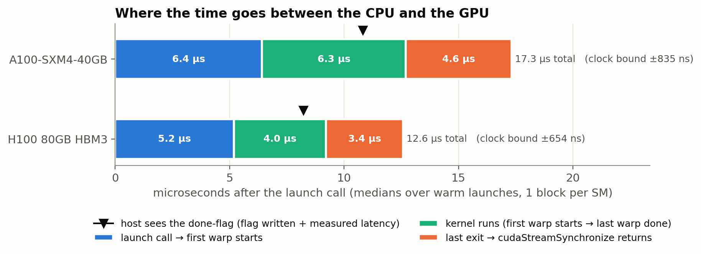
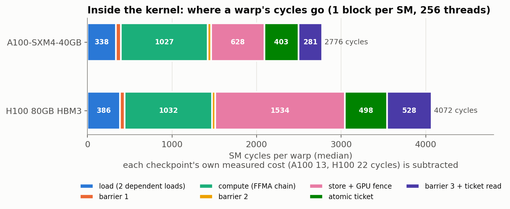
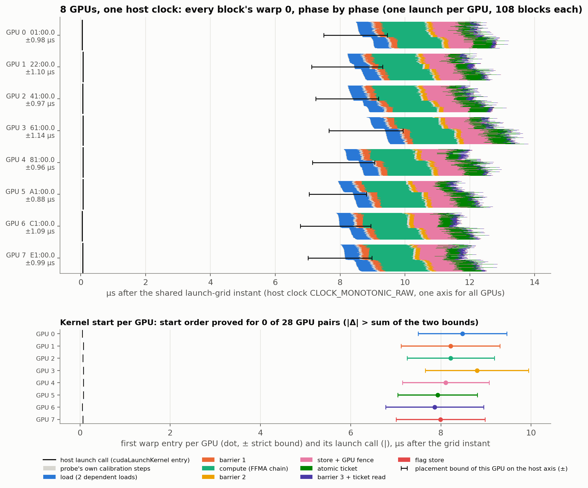

# Full-kernel GPU profiling with hardware timers

MSc Advanced Computing research, King's College London · Pierre Khoury · status 9 October 2026

This repository holds the research behind **tickbound**, a profiler that timestamps work *inside* GPU kernels with
the GPU's own hardware counters. It puts every timestamp, from every SM of every GPU in a machine, on one clock with
a proven worst-case error. With it we measured NVIDIA A100 and H100 GPUs (single GPUs, and eight A100s in one host)
and tested which instruction reorderings are legal and which save time.

The full tables, data paths and limits are in **[FINDINGS.md](FINDINGS.md)**. All GPU measurements ran on rented
vast.ai machines on 8 and 9 October 2026 ($2.66 in total).

## Summary

1. **Host time is not kernel time.** On the A100, 17.3 µs pass from the launch call to `cudaStreamSynchronize`
   returning, for a kernel that ran 6.3 µs. For short kernels the measured host time is mostly launch and completion
   overhead.
2. **We can time every part of a kernel, on every SM and on several GPUs, with proven bounds.** Inside one SM the
   timing is exact to the cycle. Across SMs it is ±17–26 ns on H100 and ±13–374 ns on A100. On the host clock it is
   ±0.55–1.03 µs for kernel-timing runs, and up to ±1.4 µs for longer runs. Eight GPUs share one timeline, and the start order of two GPUs can be proved when their starts are
   more than ~2 µs apart.
3. **Reordering: the rules are confirmed, but no speed-up over the compiler is shown yet.** Our legality checker
   agreed with the hardware on 26 of 30 hand-edited kernels and never approved a broken one. Hiding work under a
   load's latency behaves exactly as the model predicts, but the compiler already does it. Fences cannot be hidden
   at all. Section 5 gives the full answer.
4. **Some observations we have not found published.** These are listed in section 6. Examples:
   - H100's GPU timer steps by 64, 96 or 128 ns, not a fixed 64 ns.
   - Illegal SASS edits can pass output tests in 199 of 200 runs.
   - `__syncthreads()` lets arithmetic that touches only registers run while the warp waits.

## 1. Why we are doing this

GPUs now run work with deadlines and work spread over many GPUs at once:

- **GPU-based 5G/6G base stations.** NVIDIA Aerial runs the radio physical layer on GPUs, and each slot's
  processing must finish on time.
- **Multi-GPU training and inference.** Every collective step waits for the slowest GPU.
- **Distributed tracing across GPU clusters** (for example TempoTrace). It needs GPU timestamps it can trust in
  order to put events in the right order.

To find out why something is late, you have to see when each part of the work actually ran: on which GPU, on which
SM, in which part of the kernel, and how certain that time is. Today's tools each see only part of that:

| Tool | What it sees | What it does not see |
|---|---|---|
| Nsight Systems / CUPTI | kernel start and end on a timeline | anything inside a kernel |
| Nsight Compute | per-kernel metrics, sampled stall reasons | when each warp did what, on a timeline |
| Ervin Tasnadi's nanobenchmarking | exact cycle cost of one instruction in an isolated snippet | other SMs, other GPUs, the host clock |
| TempoTrace (arXiv:2609.23301) | cluster-wide event order from PTP-disciplined NIC timestamps | inside kernels; its GPU-side precision is a design target, not yet measured |

The idea of this project is **full-kernel profiling with hardware timers**. Every warp of every SM of every GPU
stamps its own progress with the GPU's counters. All the stamps then land on one host clock, each with a stated
worst-case error.

The second question builds on the first: with timing that exact, can we learn the rules of instruction reordering?
And can moving arithmetic into the time a memory load takes make a kernel faster than the compiler makes it?

## 2. Starting point: Ervin Tasnadi's nanobenchmarking

Ervin Tasnadi's post "Nanobenchmarking: cycle accurate benchmarking of CUDA kernels" (Core Velocity Lab,
3 December 2025) times single instructions to the cycle:

- He reads the SM cycle counter (`CS2R Rx, SR_CLOCKLO`) before and after a small code snippet.
- He then edits the compiled SASS with CuAssembler so that the closing read waits until the measured instruction
  has finished.

This gives exact cycle counts for an isolated snippet on one SM. Each SM's counter starts at its own value, so the
method cannot compare times between SMs.

tickbound keeps the exact cycle counter and adds the layers his method does not have:

| | Tasnadi | tickbound |
|---|---|---|
| Inside one SM | exact to the cycle | exact to the cycle. Shared-memory load: 23 cycles on A100 and H100 (his post: 22–23 on Turing) |
| Across SMs | not comparable | Each checkpoint reads timer · cycle · timer, and each SM's counter is fitted onto the GPU-wide timer. Result: ±17–26 ns on H100, ±13–374 ns on A100 |
| GPU to host | – | Clock sync before and after every run puts each GPU event on the host clock with a strict bound: ±0.55–1.03 µs |
| Several GPUs | – | 8 A100s on one host clock, every point with its bound |
| What is timed | one snippet, with the SASS edited by hand | every warp of a whole kernel. A SASS check confirms that each timed step in the binary that ran holds only the instructions its name says |
| Reordering | – | Experiments E1–E7 compile the same instructions in different orders. 30 SASS edits made with CuAssembler are judged by a legality checker and then run on the GPU |

## 3. How it works

- **Three clocks.**
  - `clock64` counts cycles exactly on each SM, but each SM's count starts from a different value.
  - `%globaltimer` is one nanosecond timer per GPU, but it only moves in steps: 1,024 ns on A100, and 64, 96 or
    128 ns on H100.
  - The host clock, `CLOCK_MONOTONIC_RAW`, is where the CPU stamps launches, polls and syncs.
- **Every checkpoint is a bracket.** It reads the timer, then the cycle counter, then the timer again, so the cycle
  value is known to lie inside a window of the timer. Each timed phase ends with an instruction that uses the
  phase's result. This makes the closing read wait for the work, as in Tasnadi's method, but done from source code.
- **One line per block.** A block of 8 warps with 12 checkpoints each gives 96 windows on one SM counter. Only a
  narrow band of cycle-to-time lines passes through all of them. Because the windows fall at different points
  between timer steps, like the marks on a vernier scale, the line is placed more finely than one timer step.
- **Host sync.** Before and after each run, a GPU thread and a host thread exchange timestamps through shared
  host memory, timed around the moments the GPU timer steps to its next value. The **strict bound** is the worst
  case over every clock offset and drift rate that agrees with both syncs.
- **SASS gate.** The binary that measured is disassembled. Each timed step is checked to contain exactly what its
  name says, for example 1 FADD + N FFMA and nothing else. Builds that fail are dropped. This caught CUDA 12.2
  inserting extra waits into timed steps.
- **Built-in checks.** On every run, three things are checked against the placed times: barrier releases, the
  order of a grid-wide atomic ticket, and when the CPU saw the done-flag. There were 0 violations.

## 4. What we found

### 4.1 Host time is not kernel time

| | A100 | H100 |
|---|---|---|
| Launch call to `cudaStreamSynchronize` returning | 17.3 µs | 12.6 µs |
| of which the kernel ran | 6.3 µs | 4.0 µs |
| final system fence, inside the kernel time (publishes the done-flag) | 2.85 µs | 1.74 µs |
| Launch to first warp, warm | 5.1–6.8 µs | 4.6–5.5 µs |
| Launch to first warp, after 50 ms idle | 9.8 µs | 24–32 µs |
| Launch to first warp, first launch of a process | 33 µs | 40 µs |

- A CPU polling a mapped flag learns that the kernel finished about 6 µs (A100) or 4 µs (H100) sooner than
  `cudaStreamSynchronize` returns.
- Each split point carries the run's clock bound: ±0.8–0.9 µs on A100, ±0.7 µs on H100.

### 4.2 Inside a kernel

**Fences cost more than the arithmetic.** These are cycles per warp, with one block of 256 threads per SM (CUDA 12.6):

| Phase | A100 | H100 |
|---|---|---|
| 256 dependent FFMA | ~1,030 | ~1,030 |
| store + GPU-scope fence | 628 | 1,534 |
| system-scope fence before the done-flag | 3,056 | 3,374 |

The system-scope fence costs about three times the arithmetic.

**Latency per instruction**, in cycles:

| Instruction | A100 | H100 | Measured as |
|---|---|---|---|
| FFMA, FADD, IMAD | 4 | 4 | dependent chains, 8 Oct |
| shared-memory load | 23 | 23 | dependent chains, 8 Oct |
| warp shuffle | 26 | 26 | dependent chains, 8 Oct |
| L2 load | 282 | 283 | dependent chains, 8 Oct |
| DRAM load | 461 | 550 | dependent chains, 8 Oct |
| L1 load, load-to-use | 50 | 49 | E1, 9 Oct |
| L2 load, load-to-use | 353 | 370 | E1, 9 Oct |
| DRAM load, load-to-use | 614 | 771 | E1, 9 Oct |

The 9 Oct load-to-use values also include the load's address arithmetic, issue and first use, on different
machines from the 8 Oct runs.

**Crowding.**
- At most 3 blocks of 256 threads were resident per SM.
- With 3 resident, the A100 slows to 5.8–6.2 cycles per FFMA because its FP32 pipe is full. The H100 stays at
  4.0–4.5.
- Straight-line code up to 64 KB runs at full speed: there is no instruction-fetch penalty.

### 4.3 Eight GPUs on one timeline: the multi-GPU instruction cross-reference

**Setup.**
- Eight A100s in one host, one process per GPU, each with its own clock sync.
- All processes launched the same kernel (108 blocks × 256 threads) on a shared 2 ms grid of the host clock.
- Every block's warp 0 is drawn phase by phase on one host axis. The phases are the loads, the barrier, the FFMA
  chain, the store + fence, the atomic ticket and the flag. Each GPU is shown with its bound, so the same phase can
  be compared across GPUs.

**Results, over 40 shared launch instants.**
- The eight launch calls were made within **30 ns** of each other.
- The kernels started 7.6–8.3 µs after the call.
- The eight kernel starts still spread by **0.78 µs** (median; range 0.51–2.70 µs).
- Each GPU's bound on the host axis is **±0.85–1.20 µs**. So the start order of two GPUs is proved only when they
  are more than **~2 µs** apart. That was the case for 11 of 1,120 GPU pairs.
- 0 violations of the order checks.

What this means: instruction-phase timelines of several GPUs can be put on one clock with a checked error on every
point. Through the host clock, ordering between GPUs is limited to gaps of about 2 µs or more.

### 4.4 Instruction reordering: the rules, tested on hardware

GPU machine code (SASS) carries its own timing. The compiler writes a stall count and scoreboard waits in front of
every instruction, and the hardware does not re-check dependencies. Moving an instruction without updating these
codes silently gives wrong results. We encoded five rules in a legality checker and tested each rule on the GPU.

**Rule 1: a load stalls only at its first use.**
- What the hardware does: independent work placed between a load and its use runs while the load is in flight.
- Measured (A100 / H100, CUDA 12.6): the break-even point matches the model N\* = (L − d)/4.
  - L2: 73 vs 81 on A100, 84.8 vs 84.7 on H100.
  - Hoisting a DRAM load saves up to 595 / 634 cycles.
  - In hand-edited SASS, the time stays flat while the load is hidden, then rises 4 cycles per slot.

**Rule 2: a store reads its registers late.**
- What the hardware does: overwriting a register that a store has not read yet makes the next instruction wait.
- Measured: 0–10 cycles in most cases. 128-bit stores with 32 warps cost +8 / +46.

**Rule 3: results need their stall cycles.**
- What the hardware does: a dependent instruction issued too early reads the old value.
- Measured:
  - FFMA stall below 4: wrong in 200 of 200 runs.
  - IADD3 stall below 4: wrong in only 8 of 200.
  - IMAD.WIDE: 13 / 12 cycles per dependent step, although the compiler encodes 10 / 8.

**Rule 4: a barrier blocks memory, not arithmetic.**
- What the hardware does: after `BAR.SYNC.DEFER_BLOCKING`, a warp keeps issuing instructions until its first
  memory instruction.
- Measured:
  - Arithmetic that touches only registers, placed after the barrier: +0 cycles, because it runs during the wait.
  - Work that touches shared memory: +296 / +1,066, its full length.

**Rule 5: fences and memory order.**
- What the hardware does: no instruction moves across a fence, and async copies keep their order.
- Measured:
  - Fence cost: GPU scope 410 / 682 cycles, system scope 2,277 / 1,252.
  - Giving the store up to 1,024 FFMA of time to drain before the fence saves ≤ 8 cycles.

**Checker against hardware.** Thirty edits to real A100 SASS were each run 200 times.
- The checker's verdict matched the hardware on **26 of 30**.
- It approved **0** broken edits.
- The 4 disagreements are cases where it was stricter than needed (all ran correctly):
  - two edits with 4 cycles between an arithmetic result and the store that uses it (the compiler always uses 5);
  - a swap of two async copies with separate targets;
  - an FFMA moved across a barrier.

**Throughput limit (E5).** Cycles per FFMA follow max(4 / ILP, p × warps per scheduler), with p = 2 on A100 and
p = 1 on H100. Once a few warps compete, the FP32 pipe, not latency, sets the speed.

## 5. Did we learn how to make kernels faster by reordering?

**The rules, yes. A faster kernel, not yet.**

What the data prove:

1. **The reordering rules hold on real hardware.** The checker agreed with the GPU on 26 of 30 edits and never
   approved an edit that gave wrong results.
2. **The latency-hiding law holds.** Independent arithmetic between a load and its first use is free until it
   covers the load's latency. After that, each FFMA costs its normal 4 cycles. The break-even point matches
   N\* = (L − d)/4 within 0–10% for L2 loads.
3. **Where hiding cannot help.**
   - Fences cost a fixed 410–2,277 cycles, whatever is placed before them.
   - Once 2 (A100) or 1 (H100) warps per scheduler compete, the FP32 pipe is full, so there is no latency left to
     hide.
4. **Two levers with a measured effect.**
   - Moving the slowest warp's register-only arithmetic past a barrier releases that barrier earlier by about the
     moved work: 224–254 cycles at 64 FFMA (256 cycles of work), 1,025–1,030 at 256 FFMA (1,024 cycles). The
     other warps finish that much sooner.
   - Using a fresh register instead of reusing one a store has not read saves up to 46 cycles.

What the data do not show is **a kernel made faster than the compiler made it**:

- In the kernels we tested, ptxas had already put each load as early as it could. There was nothing left to gain,
  and our legal moves (sliding the load later) were equal or slower, as the law predicts.
- The large savings in E1, up to ~600 cycles per DRAM load, are measured against an order we forced to be bad, which
  ptxas would not produce on its own.
- In the barrier case, the slowest warp still does the moved work after the barrier. The block as a whole finishes
  sooner only if that work can then hide under something else, and we have not measured that.
- CuAsmRL reports speed-ups from reordering ptxas's SASS for some kernels. We have not reproduced that.

So the claim "we found how to optimise kernels by hiding execution under load time" is **not supported** by these
data.

What is supported:
- We can measure exactly what any reordering does, on every SM and across GPUs.
- We know the rules that keep a reordering correct, and they are tested on hardware.
- We measured where gains can come from (latency gaps, barrier waits, store reuse) and where they cannot (fences, a
  full FP32 pipe).

The experiment that decides the optimisation question is listed first in section 8.

## 6. What is new, and what confirms known results

**Not found in the work we checked.** We checked NVIDIA's documentation, Tasnadi, CuAssembler, CuAsmRL, the
microbenchmark papers on Volta, Turing and Ampere, and TempoTrace. A full literature review is still to do.

1. Instruction-phase timelines of every warp on every SM of several GPUs on one host clock, with a proven bound on
   every point. Also the measured limit of ordering GPUs through the host clock: about 2 µs.
2. H100's `%globaltimer` steps by 64, 96 and occasionally 128 ns, not a uniform 64 ns. This was seen on two hosts,
   with CUDA 12.2 and 12.6.
3. A fence's cost does not shrink when the store before it has time to drain: it changes by ≤ 8 cycles with up to
   1,024 FFMA in between.
4. On the barrier:
   - `__syncthreads()` compiled by CUDA 12.6 (`BAR.SYNC.DEFER_BLOCKING`) lets arithmetic that touches only
     registers run during the wait at zero cost. CUDA 12.2 compiles the same source to plain `BAR.SYNC`.
   - Moving such work across the barrier is correct on hardware (200 of 200 runs), and it shortens the wait by
     about the moved work. CuAsmRL never moves instructions across a barrier.
5. Illegal SASS edits can pass output tests. A removed scoreboard wait gave wrong results in 1 of 200 runs, and
   IADD3 stall violations in 8 of 200. A stall table derived by lowering stall counts until the output breaks (the
   method CuAsmRL uses) could call these edits safe.
6. A dependent IMAD.WIDE step costs 3–4 cycles more than the stall the compiler encodes: 13 vs 10 on A100, 12 vs 8
   on H100.

**Confirms known results, now measured precisely:**
- Latency hiding with independent work (Volkov, GTC 2010).
- The dependency rules for stall counts and scoreboards (CuAssembler, CuAsmRL).
- Instruction latencies in line with the microbenchmark papers.
- The FP32 pipe width: 16 lanes per scheduler on A100, 32 on H100.
- Several µs of launch and completion overhead per kernel.

## 7. Limits

- **Clocks.** Each run uses one host and its host clock, not TAI, with no external reference clock. All checks
  are internal: ticket order, flag timing, and whether the clock fit has a solution.
- **Across SMs.** Placement across SMs assumes all SMs read one `%globaltimer`. The ticket check confirms this only
  above ~0.2 µs (H100) and ~0.3 µs (A100).
- **Kernels and machines.**
  - The kernels are our own probes and microbenchmarks, not production kernels.
  - The block size is fixed at 256 threads.
  - The 8 Oct samples are small: 5 launches per shape.
  - The machines are rented containers on shared hosts.
- **Open items.**
  - The A100 acq_rel fence measured 413 cycles with CUDA 12.6 and 565 with 12.2, with identical SASS.
  - The two E1 latency estimates differ by up to 80 cycles on H100.
  - The A100 L2 saving falls short of the model.

## 8. Next steps

1. **Reorder real kernels.** Apply moves the checker approves to kernels where ptxas leaves latency exposed (for
   example CuAsmRL's benchmark kernels, CUTLASS or cuPHY), and time them against ptxas's own schedule. This decides
   the optimisation question.
2. **Stamps anywhere, automatically.** Insert timer · cycle · timer reads into any compiled kernel by generalising
   the CuAssembler step. Use NVBit for closed-source binaries.
3. **A common reference clock across hosts.** Use PTP hardware timestamps, as TempoTrace proposes, to order events
   below ~2 µs and across machines.
4. **Repeat the open measurements** listed in section 7.

## 9. Repository

| Path | Contents |
|---|---|
| [FINDINGS.md](FINDINGS.md) | full results, all tables, limits and corrections |
| `figures_2026-10-08/` | 8 Oct figures (A100, H100). `corrected_2026-10-09/` holds the corrected versions |
| `figures_2026-10-09/` | the 8-GPU timeline (PNG, SVG and its data) |
| `tickbound_data/` | per run: metadata, analysis, log, report, SASS check results, gzipped SASS. Also strict bounds and the summary for all runs |
| `tickbound_runs/2026-10-09/` | the scripts that ran on the rented machines and locally, and two patches |
| `tickbound findings and rules 2026-10-08 (A100 + H100) v2.docx` | the 8 Oct write-up. Its host-clock bounds are replaced by FINDINGS section 2 |
| `code/`, `data/`, `demo/`, `gpu_run/`, `storyboard/`, `GPU_Clock_Findings.pptx` | earlier feasibility work (September 2026), from before tickbound |

The raw traces are kept out of git because of their size. tickbound's source code is in a separate repository and
is not yet published.

## 10. References

- E. Tasnadi, "Nanobenchmarking: cycle accurate benchmarking of CUDA kernels", Core Velocity Lab, 3 Dec 2025:
  https://corevelocitylab.com/posts/nanobenchmarking-cycle-accurate-benchmarking-of-cuda-kernels/
- TempoTrace, arXiv:2609.23301 (unreviewed white paper; its GPU timestamp figures are design targets):
  https://arxiv.org/abs/2609.23301
- CuAssembler: https://github.com/cloudcores/CuAssembler
- CuAsmRL: Optimizing GPU SASS Schedules via Deep Reinforcement Learning, arXiv:2501.08071:
  https://arxiv.org/abs/2501.08071
- Z. Jia et al., Dissecting the NVIDIA Volta GPU Architecture via Microbenchmarking, arXiv:1804.06826:
  https://arxiv.org/abs/1804.06826
- V. Volkov, Better Performance at Lower Occupancy, GTC 2010.
- NVIDIA PTX ISA, special registers `%globaltimer` and `%clock64`: https://docs.nvidia.com/cuda/parallel-thread-execution/
- NVIDIA Aerial CUDA-Accelerated RAN: https://github.com/NVIDIA/aerial-cuda-accelerated-ran
