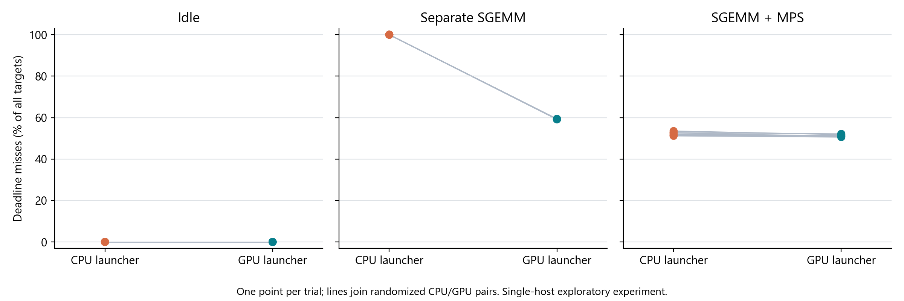
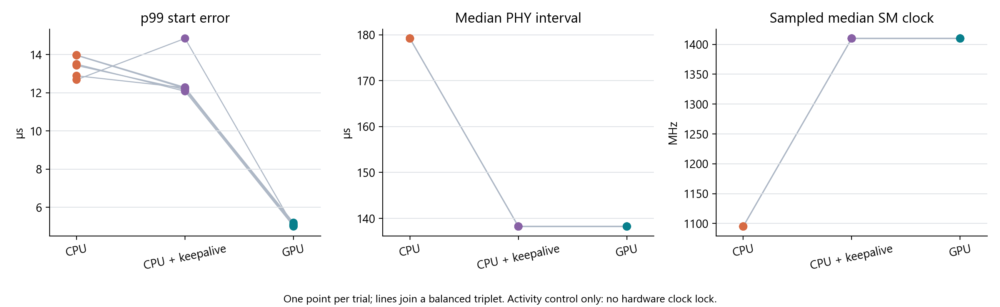

# Repeated NVIDIA cuPHY launch measurements on A100

**GPU launching reproducibly reduced idle start delay and improved deadline success under separate-process SGEMM contention.** The improvement with MPS was small. All 36 measured trials passed decoded-payload, TB CRC, CB CRC, and raw-record checks. Both launch modes execute NVIDIA Aerial's actual cuPHY PUSCH receiver on the GPU.

The new telemetry identifies an operating-state confound in these repeated idle trials: ordinary CPU launching let the isolated GPU run at 1095 MHz, while GPU launching kept it at 1410 MHz. This offers a plausible explanation for the earlier smoke test's execution-time difference; that earlier run did not collect equivalent continuous clock evidence. A separate 18-trial activity control closes the PHY execution-time gap while retaining a GPU start-timing advantage. Together, the two campaigns contain 54 measured trials and 270,000 target boundaries.

## Results across six trials per case

Each trial has 5,000 measured target boundaries after 1,000 warmup boundaries, with a 500 microsecond period and deadline. Values are **medians of the six trial metrics**, with their observed minimum and maximum in brackets. Timing percentiles include executed targets only; missed-deadline percentages include all targets, including skips.

| Condition | Launcher | Deadline misses, percent | p99 start delay, microseconds | p99 PHY interval, microseconds |
| --- | --- | ---: | ---: | ---: |
| Idle | CPU | 0 [0, 0] | 13.388 [12.557, 15.448] | 185.344 [185.344, 185.344] |
| Idle | GPU | 0 [0, 0] | 4.685 [4.609, 4.883] | 144.384 [142.336, 144.384] |
| Separate SGEMM | CPU | 100.00 [99.96, 100.00] | 2476.155 [2472.224, 2478.308] | 163.840 [162.816, 163.840] |
| Separate SGEMM | GPU | 59.32 [59.14, 59.36] | 2475.704 [2473.282, 2476.886] | 2697.728 [2695.168, 2699.264] |
| SGEMM with MPS | CPU | 52.21 [51.18, 53.50] | 16.316 [15.908, 16.872] | 1555.968 [1513.472, 1585.152] |
| SGEMM with MPS | GPU | 51.24 [50.60, 52.14] | 17.698 [15.668, 18.858] | 1534.464 [1451.008, 1570.816] |



The primary paired effects are:

| Comparison | Mean GPU minus CPU difference | Exploratory 95 percent interval |
| --- | ---: | ---: |
| Idle p99 start delay | -8.791 microseconds | [-9.547, -8.184] microseconds |
| Separate SGEMM deadline misses | -40.717 percentage points | [-40.793, -40.647] percentage points |
| MPS deadline misses | -0.883 percentage points | [-1.327, -0.450] percentage points |

The intervals resample whole CPU/GPU trial pairs, using 20,000 bootstrap draws. Six pairs on one host are exploratory evidence; these intervals omit within-trial quantile uncertainty, calibration uncertainty, and wider variation between machines. They are not production guarantees. The small MPS miss improvement occurred in all six pairs, but both modes still missed about half their deadlines. MPS p99 start timing provides no clear GPU advantage and differs on a scale comparable to calibration uncertainty.

Under ordinary process contention, the similar p99 start delays hide a large difference in successful targets. GPU launching also has a longer tail of measured PHY intervals under that contention. Executed-only percentiles compare different subsets when skip rates differ; neither percentile alone describes deadline success. The gain may combine dispatch changes with altered context activity and residency. The earlier single MPS smoke favored CPU slightly; this balanced campaign finds a small opposite effect. The datasets are not pooled.

## GPU clocks and CPU scheduling

An independent audit used an interior window from 0.9 seconds after replay wall start until 0.2 seconds before replay wall end. This excludes warmup and transition regions conservatively. Every interior sample in all six ordinary CPU idle trials reported **1095 MHz SM clock**; all GPU idle and all loaded trials reported **1410 MHz**. Memory was 1215 MHz in every interior sample, with no active clock-event bits. Sampling was requested every 100 milliseconds, so shorter excursions remain unobserved.

Across idle trials, median PHY execution medians were 179.200 microseconds for CPU launching and 139.264 microseconds for GPU launching. Their ratio closely follows the inverse frequency ratio. This is evidence of an operating-state confound, not a pure intervention on clock speed.

The rental rejected the SM-clock lock request. Its memory-clock lock command printed “not supported” even though it returned zero. [Clock-control evidence](bootstrap/host-controls/clock_control.json) records both outcomes; clocks are explicitly **unlocked**. The 300 W power limit was unchanged.

Every measured worker was directly observed once before replay with `SCHED_OTHER`, real-time priority 0, nice 0, and affinity to CPU 1. NVIDIA's requested `SCHED_RR` priority 99 was denied. The SGEMM process was pinned to CPU 2 and telemetry to CPU 3, on different physical cores. Background affinity excluded CPU 1 and its SMT sibling CPU 9. This is a matched normal-priority CPU baseline, not a real-time-tuned host baseline.

## Follow up control for GPU activity

After inspecting the clock evidence, we ran a separate comparison of ordinary CPU launching, CPU launching with a small GPU keep-alive kernel, and GPU launching. All three execute the same PHY graph. The keep-alive runs one block with one thread in the same context, on a separate nonblocking stream at the same priority as the executive. It performs no PHY launches. It starts before replay, uses a finite device watchdog, polls a host stop flag every 100 microseconds, and retires before post-run calibration. Actual start/end stamps and coverage are checked.

This follow-up uses six triplets, each containing the three variants. Every possible variant order occurs once, with triplet order shuffled using seed `20261003`. Each trial again has 5,000 measured and 1,000 warmup targets. All 18 trials passed both endpoint correctness checks and raw validation, as did three separate initial gates. This dataset is analyzed separately from the primary campaign.

| Variant | Median trial p99 start delay, microseconds | Median trial p50 PHY interval, microseconds | Median sampled SM clock, MHz | Missed deadlines across 30,000 measured targets |
| --- | ---: | ---: | ---: | ---: |
| CPU | 13.465 | 179.200 | 1095 | 23 |
| CPU with GPU keep-alive | 12.249 | 138.240 | 1410 | 22 |
| GPU | 5.066 | 138.240 | 1410 | 0 |



Keeping the GPU active while retaining CPU launching removes the observed 40.960-microsecond median PHY-duration gap. GPU launching still has lower p99 start delay in every triplet: the mean paired difference from CPU-plus-keep-alive is **-7.574 microseconds**, with an exploratory whole-triplet bootstrap interval of **[-8.492, -7.077] microseconds**. Thus the evidence supports a start-timing benefit even with matched observed SM clocks. The keep-alive also changes residency, resource occupancy and polling traffic, so it is an activity control rather than a pure clock intervention.

All rare delays were retained. Ordinary CPU trials had 5 late executions and 18 skips; CPU-plus-keep-alive had 4 late executions and 18 skips. The nine late executions show delays of 615.588–3419.129 microseconds before submission, with PHY intervals of 137.216–182.272 microseconds. The traces locate the delay before submission but do not identify its operating-system or hardware cause. Keeping the GPU active does not remove these observed host-side stalls. Zero GPU misses in this short control does not establish a zero long-term miss probability.

Control evidence: [analysis](activity_control/analysis/cuphy_idle_control.json), [independent audit](activity_control/independent_audit.json), [raw outputs](activity_control/out/), [schedule](activity_control/out/experiment.json), and [build/run logs](activity_control/). The helper and control runner were built from revision `f60304b`; the original primary binary was preserved before the incremental rebuild. Source and binary hashes distinguish the campaigns. Reproduce its analysis with `python slotbench/analysis/cuphy_idle_control.py slotbench/data/2026-10-02_a100_cuphy_repeated/activity_control/out --output-dir slotbench/data/2026-10-02_a100_cuphy_repeated/activity_control/analysis --plots`.

## Primary method and shared scope

- A100-SXM4-40GB, 108 SMs; driver 595.58.03, CUDA 13.3, Ubuntu 24.04. Same GPU for all trials.
- Pinned NVIDIA revision `4f65f97c1d5f701ce911f7dda8f1b1f3f0c7693c`; measured runner revision `1c57f9526b091fd1dfb7d4be6261ce18fa996ed6`. Build preparation used `d415aca`; the adapter hashes are verified against the measured revision.
- Same official generated TC7304 input as the [earlier smoke test](../2026-10-02_a100_cuphy_lockstep/README.md): 273 PRBs, four layers/four receive antennas, 256-QAM, MCS 27, one TB with 152 CBs. Vector SHA256: `85796206a068087c3e2e03bafb7a22118fa7f27ce87f94f00afcf1ec4ac106ca`.
- Six rounds, each containing adjacent CPU/GPU pairs for idle, separate SGEMM, and MPS SGEMM. Condition order is randomized; each condition has three CPU-first and three GPU-first pairs. Seed `20261002` and the complete schedule were saved before measurement.
- SGEMM is restarted and reports three positive activity bins before each loaded trial. MPS uses a fresh daemon per pair and a 50 percent active-thread cap for the adversary. This cap is not a bandwidth or execution-time guarantee. Both clients' MPS membership was independently checked.
- The same configured full-slot graph, stream priority, target schedule, and completion-based skip policy apply to both launch modes. Early HARQ, early SCH decoding, work cancellation and UCI are disabled. The GPU timer owns replay after host setup; it does not implement MAC scheduling.

The full dataset contains 180,000 measured target boundaries: 124,493 executions and 55,507 skips. These totals describe accounting only; statistical comparisons use trials. All 72 measured-trial endpoint checks passed with zero payload/CRC errors. There were no launch errors, timeouts, invalid stamps, or audit errors. The two initial 64-target gates passed separately.

Decoded output is checked before and after each replay, not for every intermediate slot. The workload is fixed-vector PHY replay and excludes live radio/fronthaul, changing descriptors, per-slot setup, MAC, live HARQ progression, and output delivery. The ordinary NVIDIA receiver consistently used its fallback logger: the executable resolves a different relative YAML path from the saved source configuration, and setting `cuBB_SDK` did not change that. The saved YAML hash does not establish that it was loaded.

Per-trial maximum clock-fit epsilon ranged from 1.8135 to 2.244 microseconds; individual pre/post fits ranged from 1.733 to 2.244 microseconds. The timer tick was 1.024 microseconds. Of the executed MPS targets, 123 were within the fit-bound-plus-tick scale of the deadline. These are empirical measurement scales, not statistical confidence bounds. Markers bracket the original graph roots and leaves and contribute instrumentation overhead.

## Evidence and reproduction

- [Primary analysis](analysis/cuphy_repeats.json), [trial table](analysis/trials.csv), [paired effects](analysis/paired_summary.csv), and [p99 plot](analysis/repeated_p99_start.png).
- [Independent audit](independent_audit.json): separate raw-count/deadline reconstruction, source hashes, worker identity, MPS membership, and conservative clock-window checks.
- [Raw outputs](out/), [saved experiment and schedule](out/experiment.json), [runtime logs](logs/), and [campaign transcript](campaign.log).
- [Bootstrap and host controls](bootstrap/), including the initial CPU-affinity preflight failure. It stopped before any GPU trial; no measured trials were discarded or selectively rerun.
- [Repeated runner](../../cloud/repeat_cuphy_lockstep.sh), [host probe](../../cloud/cuphy_host_probe.sh), [raw checker](../../cloud/cuphy_lockstep_check.py), and [analysis code](../../analysis/cuphy_repeats.py).

Recompute the primary analysis from the repository root:

```sh
python slotbench/analysis/cuphy_repeats.py \
  slotbench/data/2026-10-02_a100_cuphy_repeated/out \
  --output-dir slotbench/data/2026-10-02_a100_cuphy_repeated/analysis --plots
```

The primary collection archive SHA256 is `1187b356e2fb389af5b412f3b8e9a867ca0ced8d67fb4a6dbf3b14fe1ec76a4f`; the bootstrap/preflight archive SHA256 is `090becfd3425886273a1bc715c0a965476e551709b99f0c227ab8d0c95a82bc5`. Both were checked after SSH download. Archives remain outside Git; their full extracted evidence is preserved here.

The activity-control collection SHA256 is `f34b7ad1cae38a849c5338ca8b6cbc48d2984c720652f8ae4db405d9c97917bf`; its build/launch archive SHA256 is `f17b6b86bb8df4a3a3ba2b29c80a0b5ffd09be267540759b0922cfe33e83828e`. These were also verified after download. Rental `53909360` was destroyed after both campaigns were collected and audited, and its absence was verified. Estimated rental cost was about **$0.33**, excluding separately billed transfer charges; see [collection and cleanup record](collection.json).
